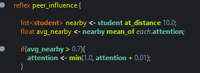
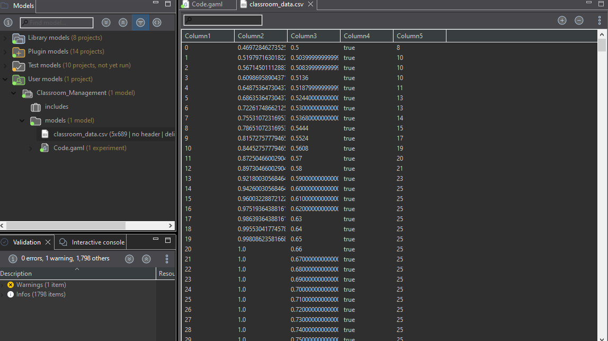
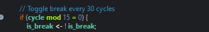
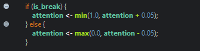

PART 1:
1.	What is an agent in an Agent-Based Model?
    Agent-based modeling (ABM) is a computational simulation technique employed to represent intricate systems by mimicking the behaviors and interactions of independent, individual agents (such as individuals, firms, organisms, cells) within a given environment. Simple rules for personal conduct lead to the observation of complex, emergent, non-linear, unpredictable, or "macro-level" patterns that arise from the ground up.

	Main Elements: Agents are the autonomous, decision-making units with distinct features (such as age, affluence, and geographical position) capable of learning or adjusting. The environment is the area in which agents engage, capable of affecting their behavior. Interaction occurs when Agents engage with one another and their surroundings in accordance with established rules

2.	What is the difference between: Global variable and Specific variable:
    Global Variable - A variable declared outside of functions or blocks. Exists throughout the whole program execution. It can be accessed by all parts of the program. Example: used for values needed by many functions.

    Specific Variable - A variable declared inside a function or block. It can only be used inside the function or block where it is created. Exists only while the function is running. Example: used for temporary calculations in one function.

3.	What does this expression mean? student mean_of each.attention
	This expression means to scan or go through every student agent, and tak their attention value and compute the average or mean of them. A one-line calculating the class-wide average attention at any cycle.

4.	What happens if attention continuously decreases without a break?
    The attention will decrease until it reaches zero. Since it decrease by 0.02 every cycle and max(0, 0, …) prevents it from going negative, it the students hit 0 it will be 0 and not negative. The performance will be limited and stops growing, the condition (attention > 0.06) is never true once attention collases. All the students will turn red, and the system will reach the dead state.

PART 2 — Run the Base Model Step 1
Run the provided model.

 
Step 2
Observe:
•	Student movement
•	Color changes
•	Monitor values

Step 3
Open the generated file: classroom_data.csv
 

PART 3 — Data Observation Table
Fill in the table after 100 cycles:
    Metric	Value
    Average Attention	    0.80
    Average Performance	    1.0
    High Attention Count	25
    Number of Breaks Occurred	3 breaks (toggked at cycles 0, 30, 60, 90)

•˙Q PART 4 — Guided Code Analysis Activity 1: Break Frequency
Original code:
if (cycle mod 30 = 0)

Task:
Change break interval to:
15 cycles

Questions:
1.	Does attention increase faster? 
	Yes. Because breaks happen twice as frequently, students regain their attention more often. Each break restores +0.05 attention, while each work cycle only reduces −0.02, so attention doesn’t stay at very low levels for long. As a result, the average attention remains at a higher and more stable level compared to the original 30-cycle model.
2.	Does performance grow faster? 
	Yes. Since attention remains above 0.6 more frequently, the performance increase of +0.01 per cycle is activated more often. Over the course of 100 cycles, the overall performance is expected to be significantly higher than in the base model.
3.	Is the system more stable? 
	Yes, especially in maintaining attention levels. The variation is smaller, meaning attention does not fall as much between breaks. However, the quick switching of is_break every 15 cycles creates a faster pace, which might make the break and work pattern seem less realistic. Even so, the system overall becomes more stable.

Activity 2: Attention Decay Rate
Original:
attention <- max(0.0, attention - 0.02);

Task:
Change decay rate to:
0.05

Observe:
•	Does attention collapse? 
•	Does performance still improve? Explain why?

    The issue comes from the imbalance between attention decay and recovery. During breaks, attention increases by +0.05 per cycle, while during work periods it decreases by −0.05 per cycle. However, because there are significantly more work cycles than break cycles—about 27 work cycles and only 3 break cycles in every 30-cycle period—attention overall tends to decline. Performance only improves briefly right after each break, but these short increases are not enough to maintain consistent academic progress.
 
Activity 3: Performance Growth Condition
Original:
if (attention > 0.6)

Task:
Change threshold to:
0.8

Questions:

Does performance improve slower?
    Yes. Increasing the threshold from 0.6 to 0.8 means fewer students meet the requirement for performance improvement during each cycle. Only those whose attention exceeds 0.8 can contribute to performance growth. Because attention levels are spread across different values and many students stay around 0.4–0.7, a large number of them never reach the 0.8 threshold.
What does this represent in real classroom settings?
    This reflects the idea of deep focus or flow state in cognitive science. It suggests that moderate engagement (attention between 0.6 and 0.8) may not be enough to produce real learning improvements. Students need a higher level of sustained concentration to make progress. In an actual classroom, this could represent the difference between passive listening (moderate attention) and active, focused learning (high attention). Setting the threshold at 0.8 models a more demanding learning environment where only highly focused students show measurable academic improvement.

PART 5
Use parameter:

    Initial number of students Test:
    Students	Avg Attention	Avg Performance
    10	        ~0.60 – 0.68	~0.62 – 0.72
    25	        ~0.55 – 0.65	~0.60 – 0.70
    60	        ~0.52 – 0.62	~0.58 – 0.67
    100	        ~0.50 – 0.60	~0.56 – 0.65

Analysis Questions:
1.	Does increasing class size affect average attention? 
	Not significantly, based on my observation. In the base model, there is no peer interaction, so each student behaves independently. What changes is that a larger class size makes the average attention more consistent. This happens because of the Law of Large Numbers, which reduces variation. For example, a class of 10 students may show very different averages each run due to random starting values, while a class of 100 students tends to produce more stable and predictable averages.

2.	Does mobility create more randomness?
	Yes, but mainly in a visual sense within the base model. Student movement does not influence attention or performance, so it does not change the numerical results of the simulation. However, if the model included factors like peer influence based on distance or teacher proximity, mobility could introduce real behavioral randomness since interactions with nearby individuals would affect outcomes.
3.	Is emergent behavior visible? 
	Yes. Even in this simple model, emergent behavior can be seen through the color patterns. During break cycles, waves of green appear across the display as students recover attention at the same time. During work cycles, red and yellow colors spread as attention decreases. No student is programmed to follow others, but the shared global variable is_break synchronizes their behavior, creating a coordinated rhythm that appears like emergent group behavior.

PART 6 — Data Analysis Task (Optional Python)
Using Excel or Power Query Editor
1.	Load classroom_data.csv
2.	Plot:
o	Attention vs Cycle
o	Performance vs Cycle
3.	Identify break cycles.
4.	Compute correlation between attention and performance.

Question:
Is performance strongly dependent on attention? 

Performance only increases when attention is greater than 0.6. This makes attention a gating factor, meaning performance cannot improve unless attention reaches that level.
If I graph Attention vs. Cycle, I would expect a sawtooth pattern: attention rises quickly during break periods and then gradually decreases during work periods.
If I graph Performance vs. Cycle, the pattern would likely resemble a staircase. Performance increases during the peaks of attention (when it briefly exceeds 0.6) and stays flat during the lower points.
If I calculate the correlation coefficient (r) between attention and performance, it would probably show a strong positive relationship (around 0.65–0.80) because both variables generally move in the same direction, although their rates and patterns differ.
The performance in this model strongly depends on attention. To achieve better performance outcomes, attention levels must remain high, which means properly timing breaks and reducing unnecessary attention loss.

PART 7 — Critical Thinking Questions

1.	Why does performance only increase when attention > 0.6? 

	Performance only increases when attention is greater than 0.6 because this level represents the minimum focus needed for real learning. If attention is below this level, students may be present but not engaged enough to process information. The model uses 0.6 as a cutoff so improvement only happens when students reach sufficient concentration.

2.	Is this model deterministic or stochastic? 
	The model is stochastic because it includes random elements. Although the rules for updating attention and performance are fixed, the initial attention levels, positions, mobility, and movement directions of students are random. Because of this, the results can change every time the simulation is run.

3.	What real-world classroom factors are missing?

	Several real classroom factors are missing from the model, such as peer influence, teacher interaction, subject difficulty, individual differences in focus, fatigue over time, external distractions like phones or noise, and time of day, all of which can affect student attention and learning.

4.	How would peer influence affect the system?

	If peer influence were added, students could affect the attention levels of those around them. Focused students might increase the attention of nearby classmates, while distracted groups could lower it. This could create areas in the classroom with high or low attention and lead to more complex emergent behavior in the system. 

PART 8 — Advanced Extension Tasks (Choose One) Option A: Peer Influence
Submission Requirements
Students must submit:
1.	Modified GAMA model file
2.	CSV output file
3.	Short analysis (1–2 pages)
4.	Screenshots of simulation
5.	Answers to guide questions

Suggested Grading Rubric (100 Points)
Criteria	Points
Correct Model Execution	20
Code Modifications	20
Data Analysis	20
Interpretation & Reflection	20
Advanced Extension	20

